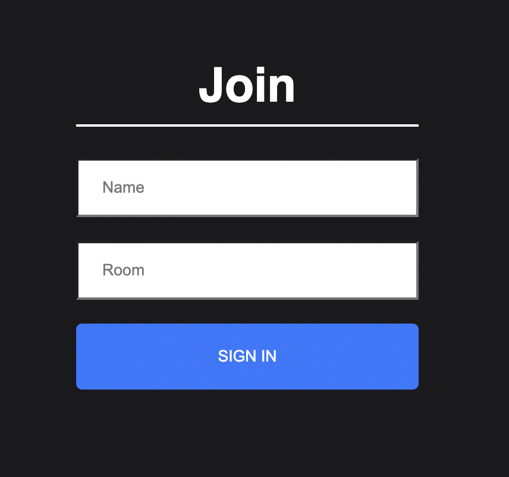
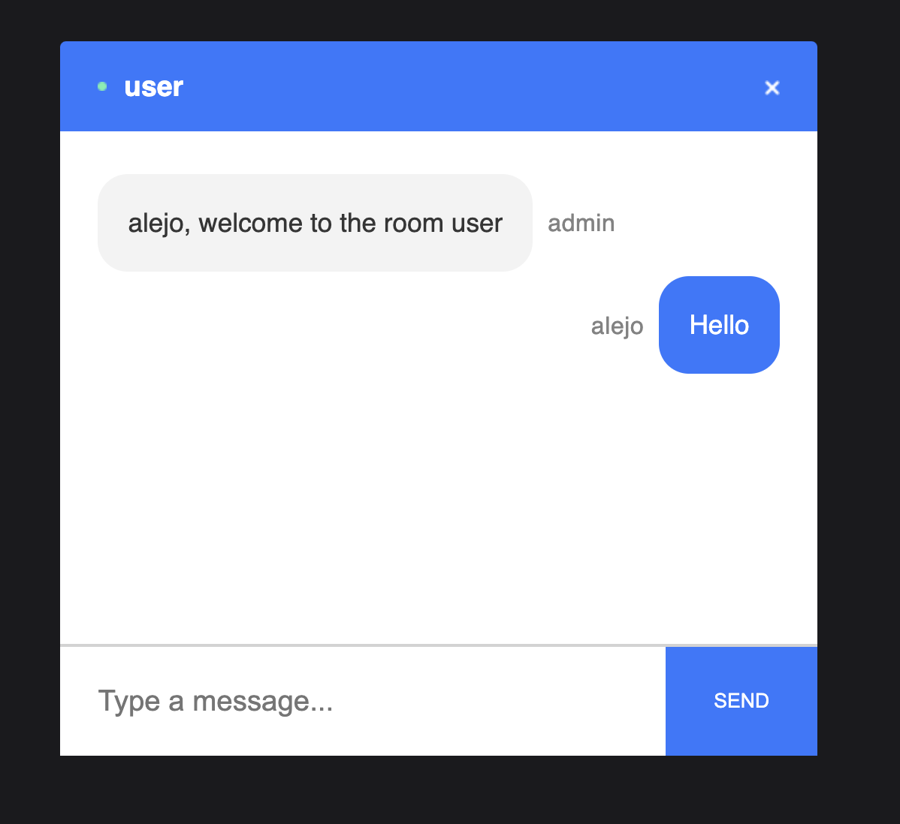

# chatify

<br/>
<p align="center">

</a>
</p>
<br/>

<br/>
<p align="center">

</a>
</p>
<br/>

## Summary

This project is inspired by discord. Uses web sockets to connect chat rooms together. You can:

- Create a room, by just typing it
- Join a room, by just typing a room that someone is currently using

- [chatify](#chatify)
  - [Summary](#summary)
  - [Prerequisites](#prerequisites)
- [Usage](#usage)
  - [Scripts](#scripts)
  - [Front end](#front-end)
  - [Testing](#testing)
- [License](#license)

## Prerequisites

Please install or have installed the following:

- [nodejs and npm](https://nodejs.org/en/download/)

# Usage

```bash
npm start
```

# License

This project is licensed under the [MIT license](LICENSE).
